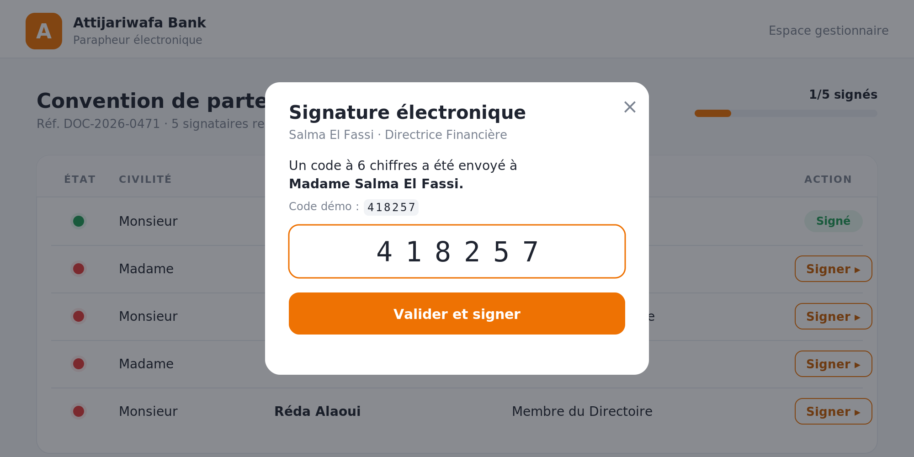

# Attijari e-Sign — Parapheur électronique avec signature par OTP

Application de **signature électronique** réalisée lors d'un stage chez **Attijariwafa Bank**. Un document (convention, contrat…) est présenté à une liste de signataires ; chacun signe après confirmation de sa **civilité (Madame / Monsieur)** et **vérification d'un code OTP** envoyé par SMS. L'état de chaque signataire est matérialisé par un **point rouge (en attente)** ou **vert (signé)**.

L'architecture est en **micro-services Spring Boot** : un service dédié à l'OTP et un service de signature qui lui délègue la génération et la vérification des codes. Le front est une **SPA React (Vite)**.

Projet de **Badr Chigar** — Ingénieur d'État en Informatique (EMSI Casablanca).

## Captures d'écran

| Parapheur (table des signataires) | Confirmation de la civilité |
|:---:|:---:|
|  |  |

| Saisie du code OTP | Progression des signatures |
|:---:|:---:|
|  |  |

## Architecture

```
                 ┌───────────────────────┐
   React (Vite)  │   signature-service   │   REST    ┌───────────────┐
  ──────────────▶│   :8082  (JPA / H2)   │──────────▶│  otp-service  │
   /api/...      │  signataires, signature│  /api/otp │  :8081        │
                 └───────────────────────┘            │  génère/vérifie│
                                                       │  les codes OTP │
                                                       └───────────────┘
```

- **otp-service** (port 8081) — génère un code à 6 chiffres associé à une référence, le stocke avec une expiration (120 s) et un nombre maximum de tentatives, puis le vérifie. Aucun état partagé avec le reste : c'est un service autonome.
- **signature-service** (port 8082) — gère les signataires (JPA/H2), expose la liste et l'action de signature. Pour signer, il **appelle le otp-service** (`OtpClient` via `RestTemplate`) afin de vérifier le code, puis enregistre la signature et la civilité.
- **frontend** (port 5173) — React + Vite. Table des signataires avec pastilles rouge/vert, modale en deux étapes (civilité → OTP). Un **mode démo hors-ligne** permet d'utiliser l'interface sans backend.

## Stack technique

| Couche | Technologies |
|---|---|
| Back (micro-services) | Java 11, Spring Boot 2.7, Spring Web, Spring Data JPA, H2, Bean Validation |
| Communication inter-services | REST (`RestTemplate`) |
| Front | React 18, Vite 5 |
| Sécurité fonctionnelle | OTP à usage unique, expiration, limite de tentatives |

## Lancer le projet

Trois terminaux :

```bash
# 1. Service OTP
cd otp-service && mvn spring-boot:run        # http://localhost:8081

# 2. Service Signature
cd signature-service && mvn spring-boot:run  # http://localhost:8082

# 3. Front
cd frontend && npm install && npm run dev    # http://localhost:5173
```

Le front proxifie `/api` vers le `signature-service`. Si le backend n'est pas démarré, l'interface bascule automatiquement en **mode démonstration** (signature simulée localement, code OTP affiché).

## Principales routes

`otp-service`

| Méthode | Route | Description |
|---|---|---|
| POST | `/api/otp/generate` | Génère un OTP pour une référence |
| POST | `/api/otp/verify` | Vérifie un code soumis |

`signature-service`

| Méthode | Route | Description |
|---|---|---|
| GET | `/api/signataires` | Liste des signataires du parapheur |
| POST | `/api/signataires/{id}/demander-otp` | Déclenche l'envoi d'un OTP |
| POST | `/api/signataires/{id}/signer` | Vérifie l'OTP et signe (avec civilité) |

## Licence

MIT © Badr Chigar
